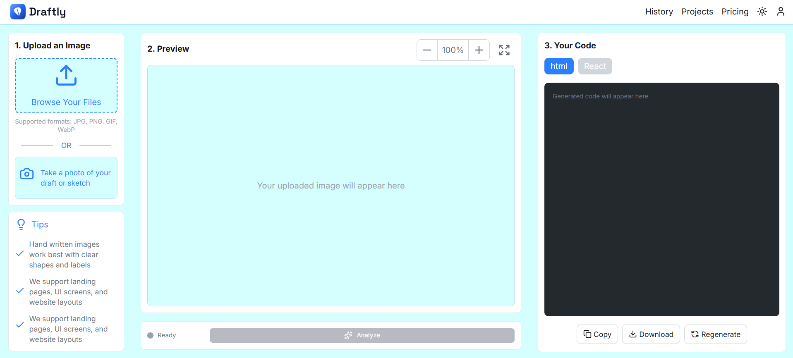

# Draftly

Upload a hand-drawn UI sketch and receive clean, working frontend code — instantly.

Draftly uses Claude's multimodal vision AI to interpret hand-drawn wireframes, identify UI components, and generate production-ready code. Unlike single-pass sketch-to-code tools, Draftly uses a **two-stage streaming pipeline**: the AI first analyzes your sketch into a structured component breakdown, lets you confirm or refine it, then streams code in real-time while a live preview builds itself on screen.

## Demo

<!-- Replace with a GIF or screenshot of Draftly in action -->


> Upload a sketch on the left, review detected components, and watch the code stream in on the right while the live preview builds itself.

## Features

- Upload images or take a live photo of a sketch
- Two-stage AI pipeline: analyze components first, then generate code
- Real-time streaming code generation via Server-Sent Events
- Live preview that builds itself as code streams in
- Output format selection: HTML or React (with Tailwind CSS)
- Syntax-highlighted code viewer (Shiki, github-dark theme)
- Copy to clipboard, download, and regenerate actions

## Tech Stack

| Layer | Technology |
|---|---|
| Framework | Next.js 15 (App Router) |
| Language | TypeScript |
| Styling | Tailwind CSS |
| AI | Anthropic SDK (Claude Sonnet, multimodal vision) |
| Streaming | Server-Sent Events (SSE) |
| Code Display | Shiki |
| Auth & Database | Supabase (Auth, PostgreSQL, Storage) |
| Icons | Lucide React |
| Deployment | Vercel |

## How It Works

```
1. Upload a sketch (drag-and-drop, file picker, or camera)
2. Claude analyzes the image and returns a component breakdown (JSON)
3. You review and confirm the detected components
4. Claude streams code token-by-token via SSE
5. The live preview renders the page in real-time as code arrives
6. Copy, download, or regenerate the output
```

## Technical Highlights

### Why a two-stage pipeline instead of a single API call?

Single-pass generation treats the sketch as a black box — Claude guesses at structure and often misidentifies components in complex layouts. By separating analysis from generation, the user can correct misinterpretations ("that's a search bar, not a dropdown") before any code is written. This human-in-the-loop step consistently produces higher quality output with fewer regeneration cycles.

### Why Server-Sent Events over WebSockets?

Code generation is unidirectional — the server streams tokens to the client. SSE is purpose-built for this pattern: it auto-reconnects on network interruption, works natively with HTTP/2 multiplexing, and requires no additional infrastructure (no WebSocket server, no sticky sessions). WebSockets would add complexity for a bidirectional channel that isn't needed here.

### Why Row-Level Security over application-level auth checks?

Application-level authorization (`if (user.id !== row.userId) throw`) is a single line of defense — one missed check in any endpoint leaks data. Supabase RLS enforces data isolation at the database level via PostgreSQL policies. Even if an API route has a bug, the database itself refuses unauthorized access. This defense-in-depth approach is standard practice in production systems handling user data.

### Why debounced preview updates instead of per-token rendering?

Updating an iframe's `srcdoc` on every incoming token (sometimes 20+ per second) causes severe flickering and layout thrashing. Draftly debounces preview updates to ~500ms intervals and validates HTML structure before injection, resulting in a smooth visual experience where the page visibly "builds itself" without visual artifacts.

## Getting Started

### Prerequisites

- Node.js 18+
- An [Anthropic API key](https://console.anthropic.com/)
- A [Supabase](https://supabase.com/) project (for auth and storage)

### Installation

```bash
# Clone the repository
git clone https://github.com/Sina177/Draftly.git
cd Draftly

# Install dependencies
npm install

# Set up environment variables
cp .env.example .env.local
```

### Environment Variables

Create a `.env.local` file with:

```env
ANTHROPIC_API_KEY=your_anthropic_api_key
NEXT_PUBLIC_SUPABASE_URL=your_supabase_project_url
NEXT_PUBLIC_SUPABASE_ANON_KEY=your_supabase_anon_key
```

### Run the Development Server

```bash
npm run dev
```

Open [http://localhost:3000](http://localhost:3000) in your browser.

## Project Structure

```
draftly/
├── src/
│   ├── app/
│   │   ├── page.tsx                # Main application page
│   │   ├── layout.tsx              # Root layout
│   │   ├── api/
│   │   │   ├── analyze/route.ts    # Stage 1: component analysis
│   │   │   └── generate/route.ts   # Stage 2: streaming code generation
│   │   ├── login/page.tsx          # Sign in
│   │   ├── signup/page.tsx         # Sign up
│   │   └── history/page.tsx        # Past generations
│   ├── components/
│   │   ├── TopNav.tsx              # Navigation bar
│   │   ├── UploadZone.tsx          # File upload area
│   │   ├── CameraCard.tsx          # Camera capture option
│   │   ├── PreviewPanel.tsx        # Image preview with zoom
│   │   ├── ComponentBreakdown.tsx  # Editable component list (Stage 1 output)
│   │   ├── LivePreview.tsx         # Real-time iframe preview
│   │   ├── CodeTabs.tsx            # HTML / React format toggle
│   │   ├── CodeViewer.tsx          # Syntax-highlighted code display
│   │   ├── CodeActionBar.tsx       # Copy, download, regenerate buttons
│   │   └── ActionBar.tsx           # Status indicator + Get Code button
│   └── lib/
│       ├── prompts.ts              # System prompts for Claude
│       └── supabase/               # Supabase client configuration
├── docs/                           # Phase documentation
├── public/
├── .env.local                      # API keys (not committed)
└── package.json
```

## Architecture

Draftly's two-stage pipeline separates analysis from generation:

**Stage 1 (Analysis):** Claude receives the sketch image and returns a structured JSON breakdown of detected UI components — names, descriptions, and hierarchy. The user reviews and edits this breakdown before proceeding.

**Stage 2 (Generation):** The confirmed component breakdown is sent back to Claude alongside the original image. Code is generated using the Anthropic SDK's streaming API and delivered to the client via Server-Sent Events. The frontend accumulates tokens and updates both the code viewer and live preview in real-time.

This approach improves output quality (Claude has explicit context about component structure) and creates a significantly better user experience compared to a single blind API call.

## Roadmap

- [x] Image upload (file picker + camera capture)
- [x] Claude vision integration for code generation
- [x] Output format toggle (HTML / React)
- [x] Syntax-highlighted code viewer
- [x] Copy, download, and regenerate actions
- [ ] Two-stage pipeline (analyze components, then generate)
- [ ] Streaming code generation via SSE
- [ ] Live preview that builds in real-time
- [ ] Supabase authentication (email/password)
- [ ] Row-level security for user data isolation
- [ ] Image storage with Supabase Storage
- [ ] History page for past conversions
- [ ] OAuth sign-in (Google, GitHub)
- [ ] Additional framework targets (Vue, Svelte)
- [ ] Collaborative mode with shared sessions

## Deployment

Deploy to Vercel:

```bash
npm run build
vercel --prod
```

Ensure environment variables are configured in your Vercel project settings.

## License

MIT
